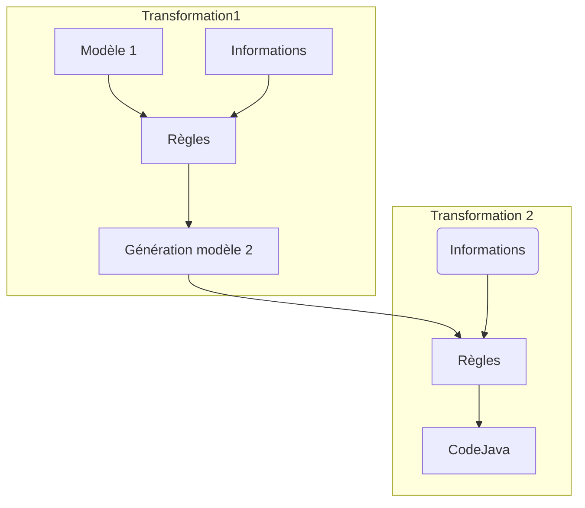

:warning: *document en cours d'écriture"

## Objectifs réunion 28/01/2020

- Faire le bilan des avancées
- Approfondir la compréhension du sujet

### Participants

| **Rôle** | **Nom** |
| :---         | :---    |
| Encadrant      | Pascal ANDRE  |
| Étudiant       |  Axel COUSSEAU  |
| Étudiant       |  Aya HAITI  |
| Étudiant       |  Matthieu JUZDZEWSKI  |

### Résumé

#### Bilan des avancées

- Lejos a été correctement installé sur l'EV3. Le problème venait vraisemblablement de la carte SD.
- Utilisation d'un outil collaboratif pour échanger facilement nos idées : https://miro.com/

#### Compréhension du sujet 

Voici un aperçu simplifié du processus de raffinenement : 

**Ce qui est donné :** le premier modèle (Modèle 1) et le code Java final. 

**Ce que nous devons étudier :** les opérations intermédiaires, c'est-à-dire les transformations de modèle successives (raisonnement en couches) qui permettent de passer du modèle initial au code final.
Il faut donc déterminer le nombre de transformations nécessaires, et pour chaque transformation, déterminer les informations requises (IP, ports, etc). L'objectif étant de raffiner progressivment le modèle.

Nous nous concentrerons sur la partie communication, c'est-à-dire l'acheminement de l'information entre différents processeurs : télécommande vers EV3, EV3 vers API java.
Pour cela, il faudra acquérir, au moment opportun, certaines données comme le type de communication du système déployé : wifi, bluetooth, filiaire, réseau...

#### Travail/pistes de réflexion

- Faire fonctionner la connexion USB
- Étudier et tester un code simple pour :
    - décomposer les différentes étapes lors du développement
    - faire le lien entre le modèle initial et le code (traçabilité)
- Installer Eclipse modeling
- Commencer à se familiariser avec ATL
    
