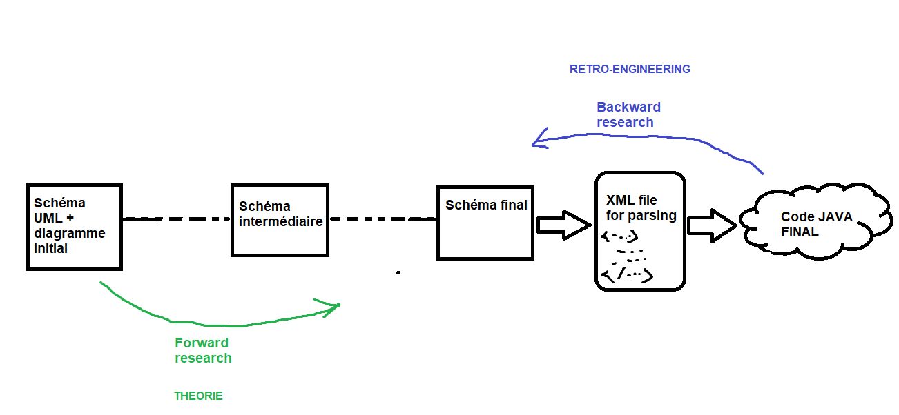
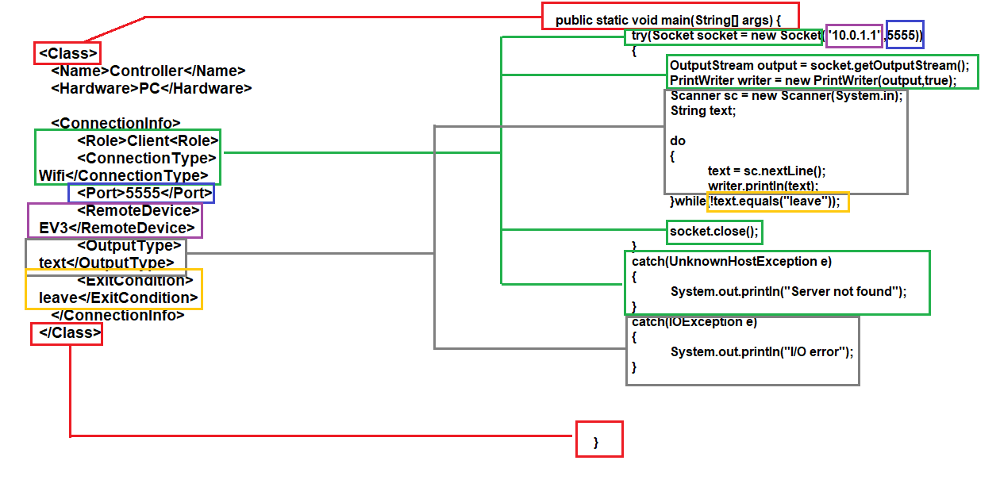

# Compte rendu de la semaine 13

- Difficultés
- Avancées
    - Rapport
    - Recherches
    - Génération de code custom

## Difficultés

Nous rencontrons des difficultés liées au confinement depuis ces deux dernières semaines. Notamment, la communication se fait à présent
de manière totalement asynchrone, et il faut parfois attendre plusieurs heures (voire plusieurs jours) avant que tout le monde ait eu l'occasion
de répondre et de s'organiser. Le travail s'en trouve considérablement ralenti. 
De plus, nous sommes tous sujets à une certaine baisse de motivation, ou plutot, une coupure vis-à-vis de nos travaux universitaires. Les choses sont ... floues.
Enfin, nous avons plusieurs projets en groupe qu'il nous faut terminer, et certains étudiants semblent avoir déserté, ce qui implique une surcharge d'efforts pour ceux qui restent.

## Avancées

### Rapport

Nous avons commencé la rédaction du rapport en LATEX (il se trouve dans le fichier *rapport*). Il s'agit pour l'instant surtout d'une introduction du sujet,
et le rapport sera complété dans les semaines à venir. Nous utilisons *Overleaf* pour la rédaction en LATEX.

### Recherches

Nous recherchons actuellement des méthodes existantes pour générer du code JAVA à partir de schéma UML (surtout avec ATL). Nous cherchons également à comprendre
plus en détails le fonctionnement de la communication à distance, le fonctionnements des protocoles en jeu.

### Génération de code custom

Outre nos recherches, nous avons décidé de commencer à coder un système de génération de code JAVA "maison". L'objectif n'est pas tellement d'arriver à quelque chose
de généraliable mais plutot d'étudier, par des expérimentations concrètes, le processus de raffinement. Voici le plan de travail que nous avons établi pour atteindre notre objectif,
sous la forme d'un schéma explicatif : 



Comme le schéma l'indique, une partie de notre équipe s'occupe de travailler à partir du code final pour arriver vers le schéma UML initial, et l'autre partie s'occupe de partir
du schéma UML initial pour arriver vers le code final. Nous espérons ainsi nous rejoindre *quelque part au milieu*, pour ensuite mettre en commun nos découvertes et peut-être parvenir
à créer un système unifié. Chaque approche souffre d'un défault majeur :

. l'approche retro-engineering va nécessairement être sujette à un problème d'overfiting, parce qu'elle se base uniquement sur le code Java final et n'est pas, ou peu, généralisable.

. l'approche théorique est bien trop vaste et coupée de la réalité, avec un risque très grand de ne mener nul part

Cependant ces deux approches ont pour vocation à se croiser d'une manière ou d'une autre, et nous esperons que les forces de chacune combleront les faiblesses de l'autre.
Sachant que dans le même temps, nous étudions ATL. En tout cas, c'est l'approche que nous avons choisi pour répondre à ce problème. Il est probalble que le temps nous manquera pour
résoudre entièrement le problème, mais nous sommes confiant dans le fait que nous arriverons à proposer un système, aussi simple soit-il, de génération de code.

Pour le moment, nous avons créés un fichier qui mimique le style **xml** et qui pourrait servir à générer le code Java final. Il s'agit là de l'approche retro-enginnering.
Voici le code xml correspondant à notre code Java qui controle les portes de garage en Wifi : 

```
<Class>
   <Name>Controller</Name>
   <Hardware>PC</Hardware>
   
   <ConnectionInfo>
	<Role>Client<Role>
	<ConnectionType>Wifi</ConnectionType>
	<Port>5555</Port>
	<RemoteDevice>EV3</RemoteDevice>
	<OutputType>text</OutputType>
	<ExitCondition>leave</ExitCondition>
   </ConnectionInfo>
</Class>

<Class>
   <Name>EV3</Name>
   <Hardware>EV3</Hardware>
   <Fonctions>
	<Fonction>
	   <Name>Open</Name>
	   <action>A100</action>
	</Fonction>
	<Fonction>
	   <Name>Close</Name>
	   <action>A101</action>
	</Fonction>
	<Fonction>
	   <Name>isOpen</Name>
	</Fonction>
   </Fonctions>
   <ConnectionInfo>
	<ConnectionType>Wifi</ConnectionType>
	<Role>Server</Role>
	<IP>192.168.43.208</IP>
	<InputType>text</InputType>
	<InputMapper>
		<Mapper>
			<value>1</value>
			<link>Open</link>
		</Mapper>
		<Mapper>
			<value>2</value>
			<link>Close</link>
		</Mapper>
	</InputMapper>
	<Port>5555</Port>
	<ExitCondition>leave</ExitCondition>
   </ConnectionInfo>
</Class>
``` 

Voici enfin le modèle conceptuel qui relie ce code XML en code JAVA (pour la partie client) : 




Evidemment, il s'agit là d'un premier jet. Il semblerait par exemple que le bloc "ConnectinType" soit plus ou moins factorisable. Peut-être l'approche théorique nous apportera 
une autre façon d'aborder le problème. Pour le moment, nous nous baserons sur ce modèle, et nous créerons un parseur de ce fichier XML qui générera le code JAVA correspondant.
Comme dit précédemment, nous avons là un problème d'overfiting, mais nous préférons nous lancer dans le vif du sujet, quitte à prendre de l'avance sur la partie théorique qui, epsérons-le,
nous appportera une façon de généraliser le processus.
