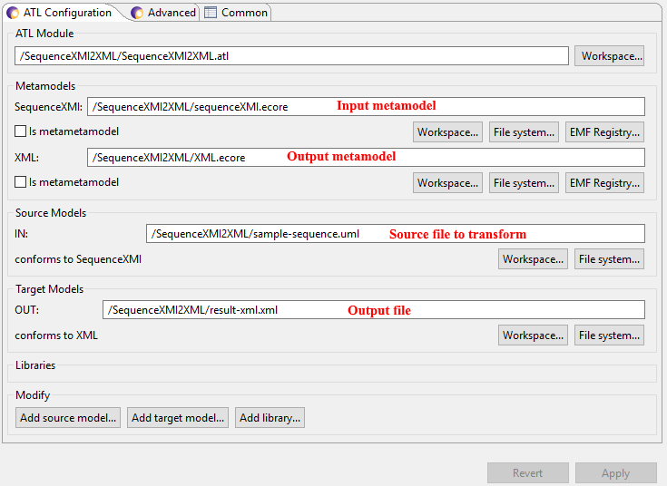

# Transfo-protocoles
Le répertoire ATL contient les différentes ressources utilisées pour transformer un fichier UML en un fichier XML utilisable par le parser.

Le répertoire Papyrus Models contient le modèle uml qui servira de fichier source pour la transformation ATL.
Il a été crée avec le Plugin Eclipse Papyrus.
Afin qu’il puisse être utilisé directement dans ATL nous remplaçons la balise racine “uml:Model” par “xmi:XMI”, et nous y ajoutons l’attribut “xmlns=SequenceXMI”. 
“SequenceXMI” est le nom du métamodèle créé pour décrire les diagrammes de séquence, cet attribut permet donc de faire comprendre à ATL ce qu’on lui donne en entrée.

Le répertoire SequenceXMI2XML contient les règles de transformation ATL et les métamodèles des fichiers source et sortie. 

Dans Eclipse, avant de lancer la transformation ATL, on renseigne les métamodèles utilisés, ainsi que le fichier source utilisé et le fichier de sortie voulu. 
Pour cela, clic droit sur le fichier ATL, allez dans **Run As > Run Configuration…** , on remplit ensuite les informations demandées.

On peut enfin lancer la transformation, et récupérer le fichier XML nécessaire à la génération de code java.
